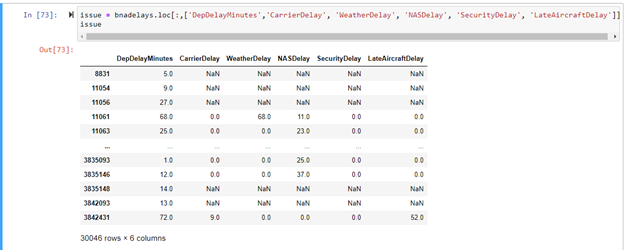

# 2021 Large Hub Domestic Departure Delays
> ### Analysis of Large Hub Airport Domestic Departure Delays overall and in comparison to Nashville International Airport (BNA)

## Table of Contents
* [Motivation](#motivation)
* [Analysis](#analysis)
* [Technologies Used](#technologies-used)
* [Visualizations](#visualizations)
* [Known Issues and Challenges](#known-issues-and-challenges)
* [Project Status](#project-status)
* [Room for Improvement](#room-for-improvement)
* [Data Sources](#data-sources)

## Motivation

Prior to COVID-19 I was a frequent flier out of BNA, but ever since then my travel habits have dwindled. (I do planning on changing that in the very near future!) My sister, however, is a frequent flier and as of late seems to always be getting stuck in XYZ airport due to flight delays. I know this as I am the constant recipient of many calls and texts to help her pass the time. That left me curious to know how my local airport, Nashville International (BNA), compares against its large hub counterparts in terms of departure delays. 

## Analysis

Utilizing 2021 [Marketing Carrier On-Time Performance Data](https://www.transtats.bts.gov/DL_SelectFields.aspx?gnoyr_VQ=FGK&QO_fu146_anzr=b0-gvzr) I set out to answer the following questions:

- How does BNA measure up to its large hub counterparts in terms flights and delays.
- What are the longest and shortest average delays (in minutes) for each Large Hub Airport as well as causes for delay?
- Based on 2021 Data what is the best day and time of day to travel from BNA?
- Which airline departing from BNA has the highest success rate for on time departure?

## Technologies Used
- Python (Pandas) in Jupyter Notebook - for exploration and aggregation
- Tableau - for visualization
- Git - for version control

## Visualizations
- [View My Tableau Visualizations here](https://public.tableau.com/app/profile/lauren.della.russo)

## Known Issues and Challenges
####  Departure Delay Minutes (DepDelayMinutes)
- While the Departure Delay Minutes column displays a time in minutes there was no corresponding value in any of the delay reason columns and/or the minutes did not match. 

## Project Status
Project is: complete (for now - I plan add content in the future)

## Room for Improvement
- Use multiple years of data for additional comparison and more accurate measures
- Pull in arrival data to see how delayed departures directly impact arrival time
- Create a Tableau Path Map to show large hub departures and all destination arrivals by airline 

## Data Sources
- [Wikipedia](https://en.wikipedia.org/wiki/List_of_the_busiest_airports_in_the_United_States) List of the busiest airports in the United States
- [Amadeus Self Service APIs](https://developers.amadeus.com/self-service/category/air/api-doc/airport-and-city-search) Airport & City Search
- [Bureau of Transportation Statistics](https://www.transtats.bts.gov/DL_SelectFields.aspx?gnoyr_VQ=FGK&QO_fu146_anzr=b0-gvzr) 
On-Time : Marketing Carrier On-Time Performance 

